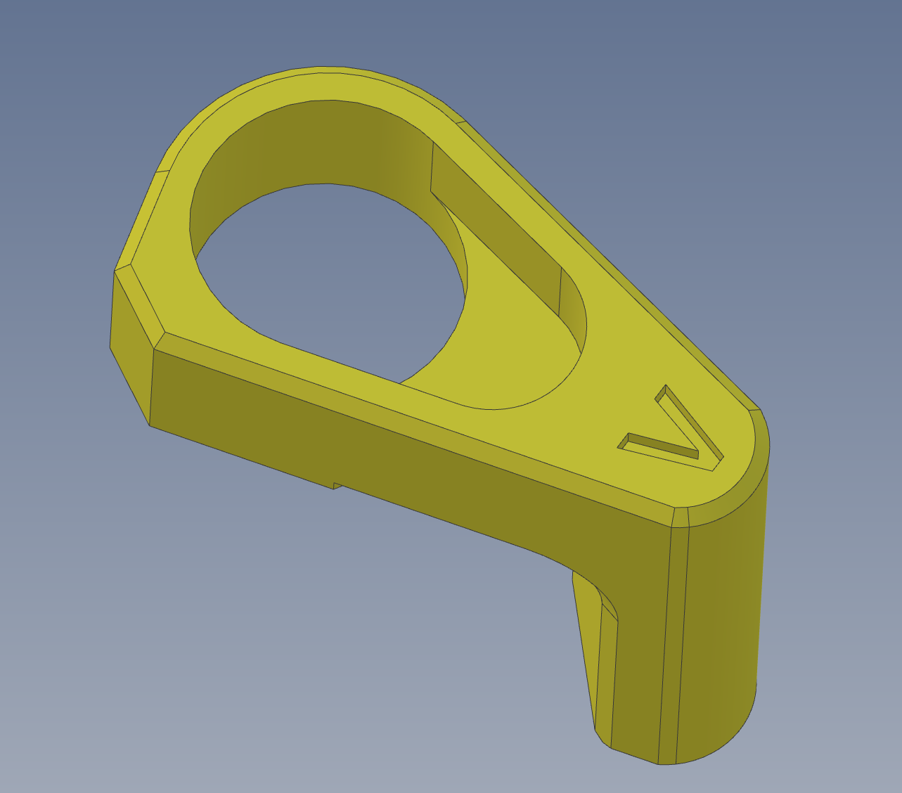

ERCF V2

Simple changes to the MGS90 arm to use the manufacturer supplied arm.
I kept having slippage issues and this modification solved it.

The step is only provided, as it was not recreated in Fusion, merely modified to create the cavity.

Maybe a CAD mster can update the Fusion model with the concept...
CF
